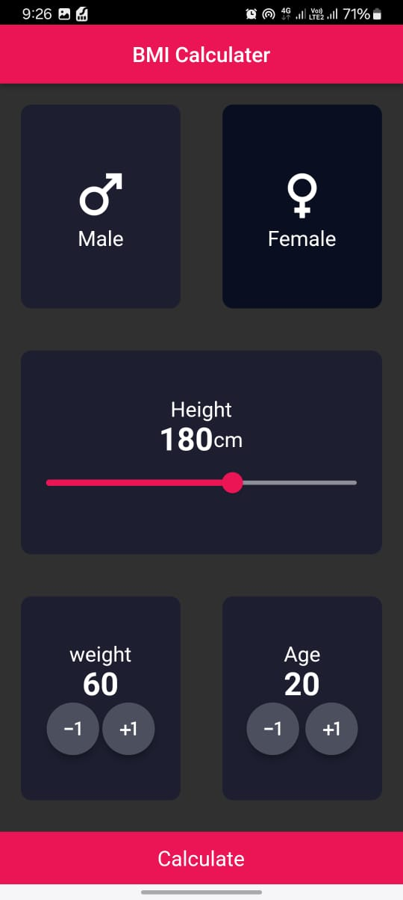
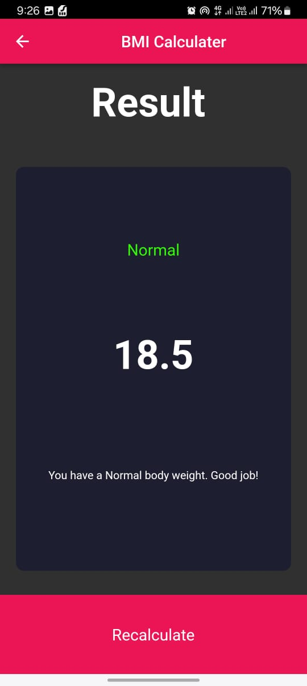
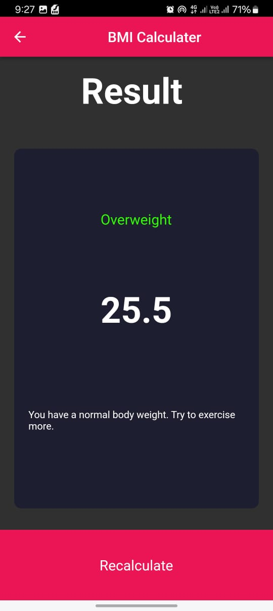
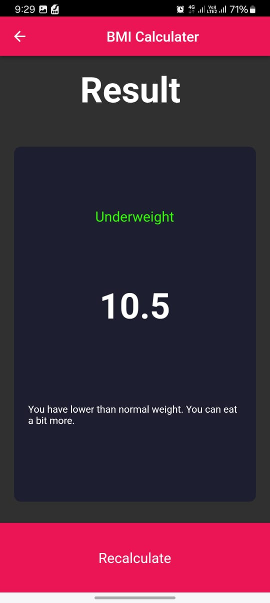

# BMI Calculator

A simple Body Mass Index (BMI) Calculator built using **Flutter**. This project allows users to calculate their BMI based on their weight and height, and it provides feedback on their health status (e.g., underweight, normal, overweight). this app live on play stor      ->       "https://play.google.com/store/apps/details?id=com.devglim.bmi_calculator&hl=en"

---

## Features

- Input fields for weight (kg) and height (cm).
- Instant calculation of BMI upon data entry.
- Health status feedback (underweight, normal, overweight, or obesity).
- Responsive UI for mobile devices.

---

## Screenshots

#### Home Screen


#### Results Screen




---

## Tech Stack

- **Flutter**: Cross-platform framework for UI design and functionality.

---

## How to Run

1. Clone the repository:  
   ```bash
   git clone https://github.com/your-username/bmi-calculator.git

